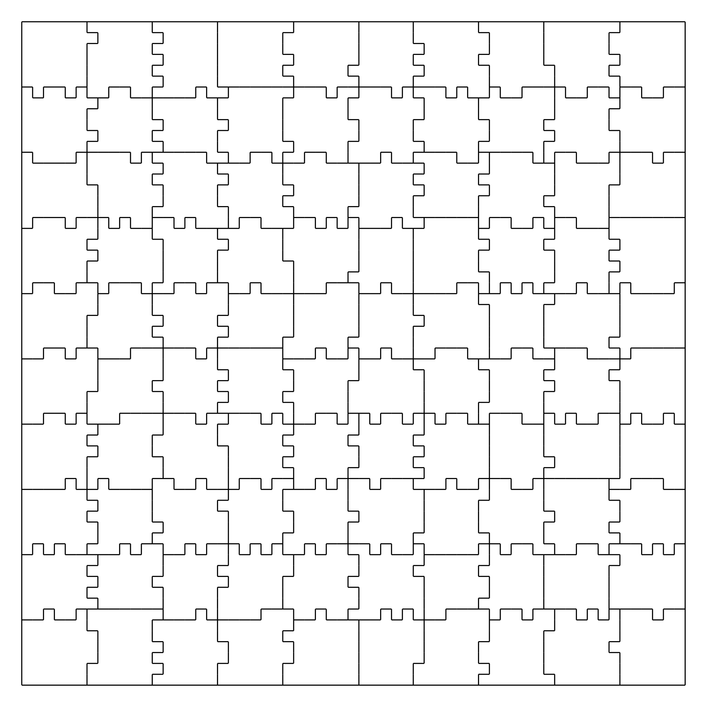

# Jigsaw Challenge
Write a cluster-based program to solve a digital jigsaw puzzle


## Problem Statement
You are given the geometry of a jigsaw puzzle and a set of files
where each file contains the outline of one puzzle piece.  Your
program must rotate and rearrange the puzzle pieces to assemble
the jigsaw puzzle.

On ClusterFight nights you will be given an encrypted zip file
with the pieces.  At challenge start time you will be given the
password to the zip file.  Read the pieces and rearrange them
into a solution as quickly as possible.  A program is available
to verify that you have correctly solved the challenge.


## The Puzzle
The outline of each piece is given as a portable bitmap file
that looks something like the following:
```
    P1
    # p0044.pbm
    7 7
    1 1 0 0 1 1 0
    1 1 1 1 1 1 1
    0 1 1 1 1 1 0
    0 1 1 1 1 1 1
    1 1 1 1 1 1 1
    0 1 1 1 1 1 0
    0 1 0 1 0 1 0

```
Each piece is given a random number and a random orientation.  The goal
of a solver program is to list the pieces and their clockwize orientation
starting from the top left corner and going from left to right.  A
solution gives the file name of the piece and how much the piece should
be rotated in the counterclockwise direction before placement.  The
output of a solver program might look like
```
      p0044.pbm 270
      p0197.pbm 0
      p0073.pbm 180
      ....
```

Consider four valid, but rotated, solutions to a 3x3 puzzle:
```
    123  369  987  741
    456  258  654  852
    789  147  321  963
```
A rotated solution is still a valid solution and a puzzle with many
pieces may have duplicate pieces.  This makes it difficult to have
"one good solution".  To work around this we use a program to check
for a valid solution by putting all the pieces on a grid.  If there
are no gaps or overlaps the solution is valid.


## Getting Started
The program makejigsaw.c generates the puzzles.  Compile it as
' gcc -o makejigsaw makejigsaw.c

The program takes three command line parameters, the width of the
puzzle (in # of pieces), the height of the puzzle, and how many
"fingers" to allow on each edge.  

The program outputs three types of data.  The first is a set of
(height X width) .pbm files with the puzzle pieces.  The second
is the solution as a text file with the correct placement and
counterclockwise rotation of each piece.  The third is an SVG
file that shows the solution.  You may want to use inkscape to
view the SVG file.  

Shown below is an image of the solution.svg file for the command
' makejigsaw 10 10 7





As described above, a solution to the puzzle is stored in solution.txt.
Solving the puzzle means creating a solution.txt file.  You can validate
your solution with the validatejigsaw program.  A typical flow might be
as follows:
'''
   makejigsaw 10 10 7
   rm solution.txt
   (run your propgram to create a new solution.txt)
   validatejigsaw 10 10 7
'''

-

